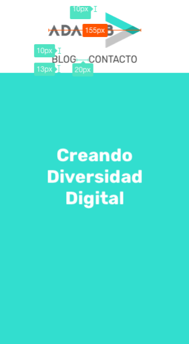
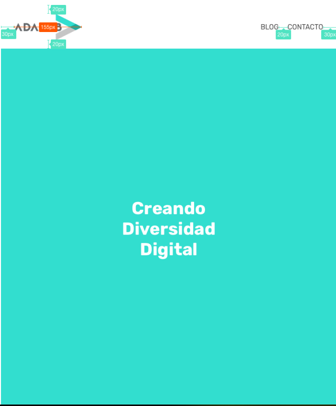

# Intermediate evaluation

In this exercise we are going to layout a simplified version of Adalab's homepage.

### Elements:

1. A fixed header occupying the entire width of the screen and containing:

- the Adalab logo with a link to the home page.
- An online menu of options.

2. There is a main section that has a background colour and a title that reads "Creating Digital Diversity". This text has to be centred both vertically and horizontally across the entire window of the page.

### Style information:

The website has to be responsive, i.e. it must work correctly for the following sizes:

#### Mobile (by default):

- The logo has a size of 155px wide.
- The header menu is placed below the logo.
- The text of the menu options is 16px in size.
- The title text "Creating Digital Diversity" has a size of 30px.

#### Tablet and desktop (from 768px):

  

- The header menu is placed on the right.
- The text of the menu options has a size of 16px.
- The title text "Creating Digital Diversity" has a size of 40px.
